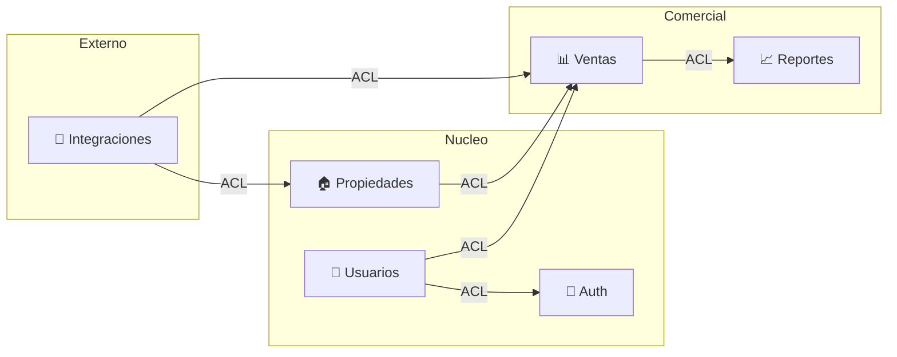

import { Card, CardGrid } from '@astrojs/starlight/components';

ALVAS es un CRM inmobiliario organizado por módulos de dominio, arquitectura hexagonal y lenguaje ubicuo.

## Arquitectura



## Tech Stack

| Capa | Tecnología                |
| ---- | ------------------------- |
| API  | Hono + Zod + Drizzle ORM  |
| Web  | SvelteKit 5 + Tailwind v4 |
| DB   | Cloudflare D1 (SQLite)    |
| Docs | Astro Starlight + TypeDoc |

## Quick Start

```bash
git clone <repo>
bun install
bun run --cwd apps/api dev        # API en :8787
bun run --cwd apps/web dev        # Web en :5173
bun run docs:dev                  # Docs en :4321
```

## Secciones

<CardGrid>
  <Card title="Arquitectura" icon="settings">
    DDD táctico, hexagonal, ADRs, Context Map y reglas de dependencia.
  </Card>
  <Card title="Dominio" icon="list">
    Lenguaje ubicuo: captaciones, leads, clientes, propiedades, contratos y citas.
  </Card>
  <Card title="Flujos" icon="swap">
    Procesos comerciales desde captación hasta contrato y seguimiento CRM.
  </Card>
  <Card title="Especificaciones" icon="document">
    SDD: especificaciones funcionales trazadas a tests ejecutables.
  </Card>
  <Card title="Calidad" icon="check">
    Mutation testing, coverage y walkthrough logs.
  </Card>
  <Card title="Referencias" icon="reference">
    TypeDoc API/Web, Scalar OpenAPI y Storybook de componentes UI.
  </Card>
</CardGrid>
